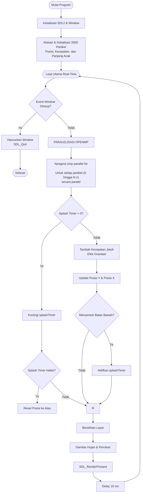
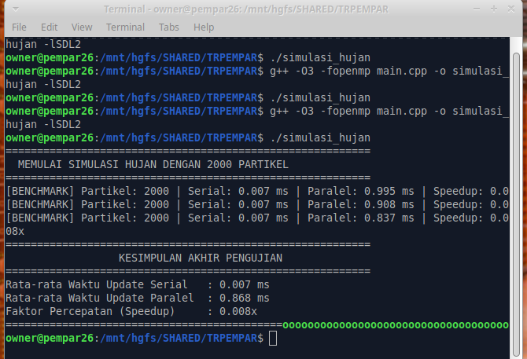
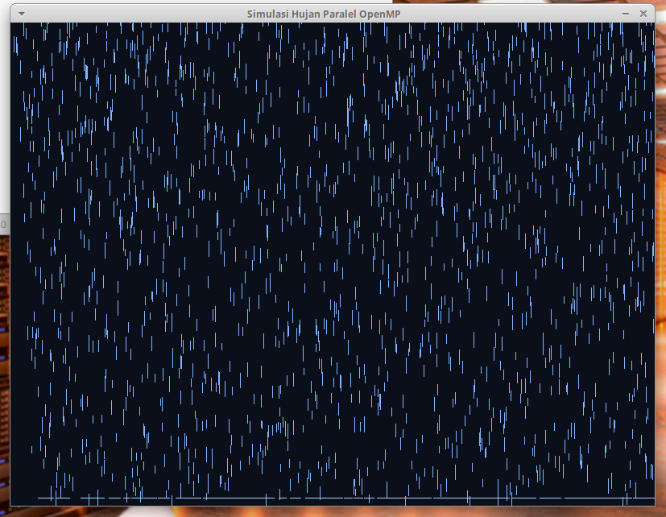

## 1. Identitas Praktikan

| Item          | Keterangan                        |
|---------------|------------------------------------|
| Nama          | KALFIN ADI PRSETIO                  |
| NIM           | 622023002                   |
| Mata Kuliah   | CE 602 — Praktikum Pemrosesan Paralel |
| Tugas         | Tugas Rancang — Particle System Paralel |

## 2. Langkah Kompilasi
Buka terminal/command prompt pada direktori tempat file main.cpp berada, kemudian jalankan perintah kompilasi berikut:

Bash

g++ -O3 -fopenmp main.cpp -o simulasi_hujan -lSDL2

Keterangan Flag:

-O3 : Mengaktifkan optimasi tingkat tinggi agar eksekusi program berjalan maksimal.

-lSDL2 : Menghubungkan program dengan library SDL2 untuk visualisasi grafis.

-fopenmp : Mengaktifkan fitur multi-threading OpenMP pada kompiler GCC.

Menjalankan program

./simulasi_hujan


## 3. Cara Kerja Program

Program ini mensimulasikan animasi hujan menggunakan **SDL2** sebagai media visualisasi dan **OpenMP** untuk mempercepat proses pembaruan posisi partikel. Alur kerja program dijelaskan sebagai berikut.

### 3.1 Inisialisasi SDL2

- Program menginisialisasi library SDL2.
- Membuat **window** sebagai tampilan utama simulasi.
- Membuat **renderer** yang digunakan untuk menggambar seluruh objek pada layar.

### 3.2 Inisialisasi Partikel

- Program membuat sebanyak **2000 partikel hujan** (dapat diubah melalui variabel `NUM_PARTICLES`).
- Setiap partikel memiliki atribut yang diinisialisasi secara acak, yaitu:
  - Posisi awal pada sumbu X.
  - Posisi awal pada sumbu Y.
  - Kecepatan jatuh.
  - Panjang tetesan hujan.
  - Status percikan (*splash timer*).

### 3.3 Loop Utama Program

Setelah seluruh partikel berhasil dibuat, program memasuki **loop utama** (*main loop*) yang akan terus berjalan hingga pengguna menutup jendela aplikasi.

Pada setiap iterasi loop dilakukan beberapa proses berikut.

#### a. Pengecekan Event

- Membaca seluruh event dari SDL2.
- Memeriksa apakah pengguna menutup window.
- Jika window ditutup, program keluar dari loop dan mengakhiri simulasi.

#### b. Update Partikel Menggunakan OpenMP

- Posisi seluruh partikel diperbarui menggunakan directive:

```cpp
#pragma omp parallel for
```

- OpenMP membagi pekerjaan pembaruan partikel ke beberapa thread sehingga proses dapat berjalan secara paralel.
- Untuk setiap partikel dilakukan proses berikut:
  - Jika partikel sedang berada pada fase **splash**, maka nilai `splashTimer` dikurangi.
  - Jika `splashTimer` habis, partikel dikembalikan ke bagian atas layar dengan posisi acak.
  - Jika partikel sedang jatuh, kecepatan bertambah akibat efek gravitasi.
  - Posisi X dan Y diperbarui sesuai kecepatan yang dimiliki.
  - Ketika mencapai batas bawah layar, partikel akan memasuki fase percikan (*splash*) sebelum direset kembali ke atas.

#### c. Rendering

Setelah seluruh partikel selesai diperbarui, program melakukan proses rendering dengan langkah berikut.

- Membersihkan layar dari frame sebelumnya.
- Menggambar seluruh partikel hujan beserta efek percikan.
- Menampilkan hasil gambar menggunakan `SDL_RenderPresent()`.

#### d. Pengaturan Frame Rate

- Program memberikan jeda sekitar **16 ms** pada setiap iterasi.
- Jeda ini menjaga animasi tetap stabil pada sekitar **60 FPS (Frame Per Second)** sehingga pergerakan hujan terlihat lebih halus.

### 3.4 Benchmark Performa

Selain menjalankan simulasi, program juga melakukan pengujian performa untuk membandingkan implementasi **serial** dan **paralel**.

- Mengukur waktu eksekusi update partikel secara serial.
- Mengukur waktu eksekusi update partikel menggunakan OpenMP.
- Menghitung rata-rata waktu eksekusi.
- Menghitung nilai **speedup**.
- Menampilkan seluruh hasil benchmark pada terminal.

# 4. Flowchart Program




## 5. Implementasi Paralel OpenMP

Implementasi paralel pada program ini menggunakan **OpenMP** untuk mempercepat proses pembaruan (update) posisi seluruh partikel hujan. Bagian ini merupakan proses yang paling sering dieksekusi karena dilakukan pada setiap frame animasi, sehingga menjadi kandidat yang tepat untuk diparalelkan.

### 5.1 Kode Implementasi

```cpp
#pragma omp parallel for
for (int i = 0; i < NUM_PARTICLES; i++)
{
    particles[i].update();
}
```

### 5.2 Cara Kerja OpenMP

Directive `#pragma omp parallel for` digunakan untuk membagi proses perulangan ke beberapa thread yang berjalan secara bersamaan. Setiap thread memperoleh sebagian indeks partikel untuk diproses secara independen.

Pada setiap iterasi, thread melakukan beberapa operasi berikut:

- Memperbarui posisi horizontal (**X**) dan vertikal (**Y**) partikel.
- Menambahkan kecepatan jatuh akibat efek gravitasi.
- Memeriksa apakah partikel sedang berada pada fase **splash**.
- Mengurangi nilai `splashTimer` apabila splash masih aktif.
- Mengembalikan partikel ke bagian atas layar apabila splash telah selesai.
- Mengaktifkan efek splash ketika partikel mencapai batas bawah layar.

### 5.3 Pembagian Beban Kerja

OpenMP secara otomatis membagi seluruh partikel ke beberapa thread sesuai jumlah inti (core) prosesor yang tersedia.

Sebagai contoh, apabila terdapat **2000 partikel** dan **4 thread**, maka pembagian pekerjaan dapat berlangsung seperti berikut.

| Thread | Partikel yang Diproses |
|--------:|------------------------|
| Thread 0 | 0 – 499 |
| Thread 1 | 500 – 999 |
| Thread 2 | 1000 – 1499 |
| Thread 3 | 1500 – 1999 |

Dengan mekanisme tersebut, proses pembaruan posisi partikel dapat dilakukan secara bersamaan sehingga waktu komputasi berpotensi menjadi lebih singkat ketika jumlah partikel cukup besar.

### 5.4 Keamanan Paralel (Race Condition)

Implementasi ini tidak mengalami **race condition** karena setiap thread hanya mengakses dan memperbarui data milik satu partikel pada indeks yang berbeda.

Tidak ada variabel global yang dimodifikasi secara bersamaan oleh beberapa thread sehingga proses update dapat dilakukan secara aman tanpa memerlukan mekanisme sinkronisasi tambahan seperti `critical` atau `mutex`.

### 5.5 Keuntungan Penggunaan OpenMP

Penggunaan OpenMP pada simulasi ini memberikan beberapa keuntungan, antara lain:

- Memanfaatkan kemampuan **multi-core processor**.
- Memproses banyak partikel secara bersamaan.
- Mengurangi waktu komputasi ketika jumlah partikel sangat besar.
- Implementasi relatif sederhana karena hanya memerlukan penambahan directive OpenMP tanpa mengubah struktur program secara signifikan.

Namun, pada jumlah partikel yang kecil seperti **2000 partikel**, waktu eksekusi paralel dapat lebih lambat dibandingkan serial. Hal ini disebabkan oleh **overhead** pembentukan thread dan proses sinkronisasi yang masih lebih besar daripada beban komputasi pada setiap iterasi.

### 6. Hasil Pengujian

Pengujian dilakukan dengan jumlah partikel 2000.

Output terminal:



MEMULAI SIMULASI HUJAN DENGAN 2000 PARTIKEL


[BENCHMARK]
Serial   : 0.007 ms
Parallel : 0.995 ms

[BENCHMARK]
Serial   : 0.007 ms
Parallel : 0.908 ms

[BENCHMARK]
Serial   : 0.007 ms
Parallel : 0.837 ms

KESIMPULAN AKHIR PENGUJIAN

Rata-rata Serial   : 0.007 ms
Rata-rata Parallel : 0.868 ms
Speedup            : 0.008x

---

## 7. Analisis Hasil

Berdasarkan hasil pengujian diperoleh:

| Pengujian     | Serial (ms) | Parallel (ms) |    Speedup |
| ------------- | ----------: | ------------: | ---------: |
| 1             |       0.007 |         0.995 |     0.007x |
| 2             |       0.007 |         0.908 |     0.008x |
| 3             |       0.007 |         0.837 |     0.008x |
| **Rata-rata** |   **0.007** |     **0.868** | **0.008x** |


Terlihat bahwa implementasi paralel menghasilkan waktu yang lebih lama dibandingkan implementasi serial.

Hal ini disebabkan karena jumlah partikel yang relatif sedikit sehingga overhead pembuatan dan sinkronisasi thread OpenMP lebih besar daripada waktu komputasi yang sebenarnya. Pada kondisi seperti ini, implementasi serial lebih efisien.

Namun apabila jumlah partikel diperbesar (misalnya 50.000 hingga 500.000 partikel), maka OpenMP akan mulai menunjukkan keuntungan karena beban kerja dapat dibagi ke beberapa inti prosesor.

## 8. Kesimpulan

Berdasarkan hasil implementasi dapat disimpulkan bahwa:

Program simulasi hujan berhasil dibuat menggunakan SDL2.
OpenMP berhasil digunakan untuk melakukan update posisi partikel secara paralel.
Program dapat dikompilasi menggunakan GCC dengan opsi -fopenmp.
Pada pengujian dengan 2000 partikel, implementasi paralel belum memberikan peningkatan performa karena overhead thread masih lebih besar dibandingkan waktu komputasi.
Implementasi OpenMP akan lebih efektif apabila jumlah partikel jauh lebih besar sehingga setiap thread memiliki beban kerja yang cukup.
